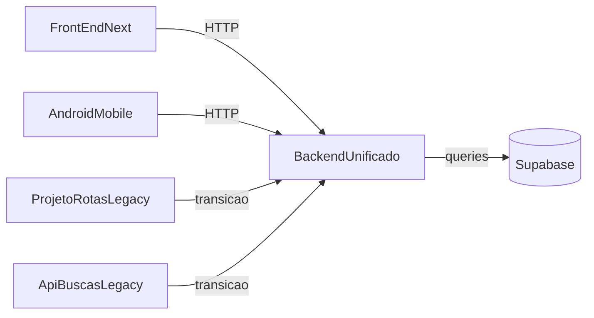

# Visao Geral da Arquitetura

## Modulos

- `backend-unificado`: backend principal (compatibilidade v1 + dominio v2).
- `MedTime/apps/FrontEnd`: interface web em Next.js.
- `MedTime/apps/ProjetoRotas`: legado em desativacao.
- `api-buscas`: legado de integracao em desativacao.
- `mobile`: app Android que recebe agendamentos e exibe em formato amigavel.

## Fluxo principal

## Objetivo de organizacao

- Documentacao centralizada na raiz.
- Setup reproduzivel em Linux/Windows/macOS.
- Templates de ambiente sem segredos.
- Politica de versionamento consistente para evitar arquivos locais no Git.

